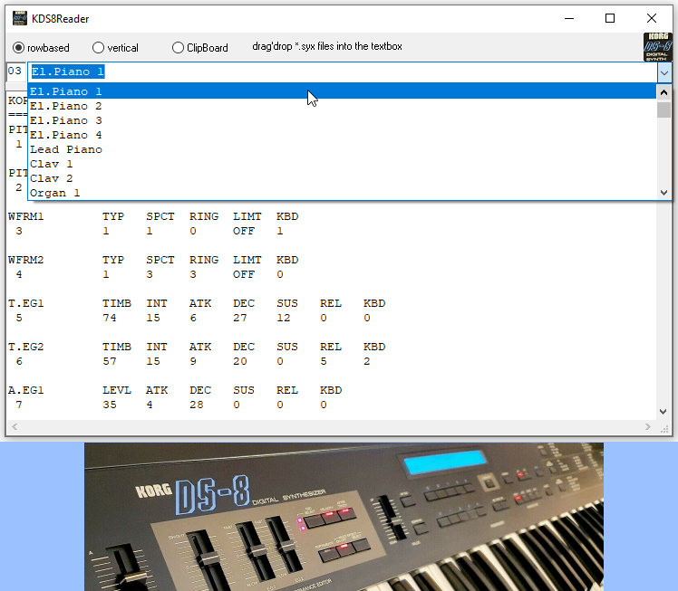

# KORG_Read_DS8syx
## Reader of SysEx-files (\*.syx) for the old 4-Op FM-Synth Korg DS-8  

 

Project started in jun.2012, when I had problems with my old synth.  
In the early days of MIDI, System-Exclusive-Data (Sys-Ex/syx) was the only way 
to share sounds between different synths, at least of the same synth model.  
Roland corp defined the midi protocol in the 80ies. But it's kinda hard to 
read all bits in the right order. Until now I do not know if every bit will be 
read correctly. So the program never made it to a syx-writer, but anymay, it 
helped me out to solve my DS-8-problems, to see whats inside a syx-file, to 
distinguish different sounds and to spot the differences betweeen the sounds 
at one glance.  
If you love vintage gear like I do, you could take this little project as a 
starting point for your own ideas.  
You may also have a look at my other KORG related project:  
https://github.com/OlimilO1402/KORG_Read_pcg  

